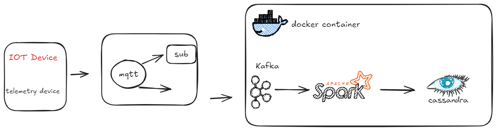

# IOT_DE
Mimicking f1 telemetry data, using an mqtt broker to subscribe and to act as a producer to load the data in real-time to kafka which will streamed to Apache Spark for data transfromation in real-time which will than be stored in Apache Cassandra.

# Architecture 

